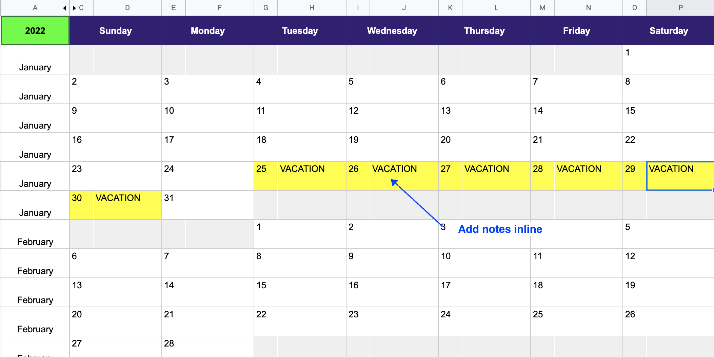

# Google Sheets Calendar
Create a calendar view inside Google Sheets. Wanted to embed a simple calendar view in Google Docs, to keep track of project plans. Turns out that is harder than i thought. Quite a few "templates" out there. But some are paid, others are partially done, or static. 

### Please **[Download here](https://docs.google.com/spreadsheets/d/13Ip7XqFefAhJLJExgPwqhUVyzK9U10TeIDiKt4Wc6SU/edit?usp=sharing).**

### Features:
* Shows the calendar for entire year. 
* Can be set to any year in the future or past
  * You can set the year, and then download as PDF, HTML (or yes even Micro$%#t Excel)   
* You can add comments in the cells 
* Fairly easy to add multiple years, or show fewer months. But may need some editing

### Download Printable calendars

### Create your own Calendar

### Changing the year 

### Annotating dates with notes 

###@todo: 
Might add more params, like starting month, and also the ability to do just a single mothe etc. Please reach out if you need other features. 

